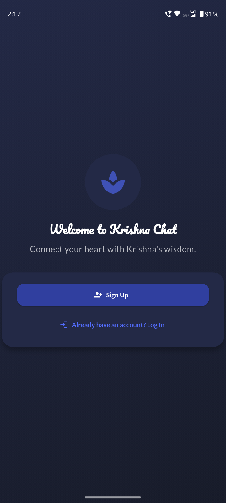
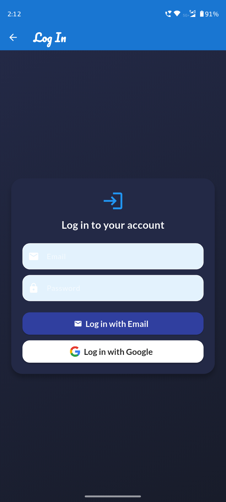
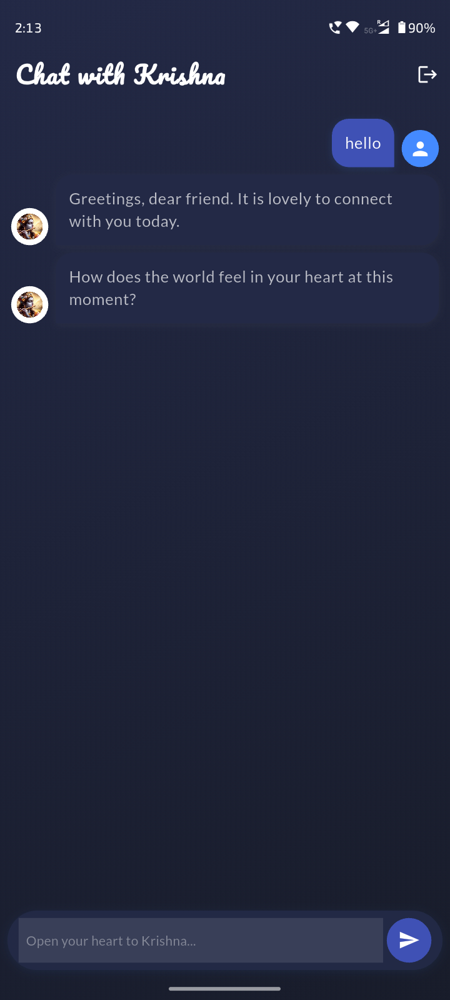
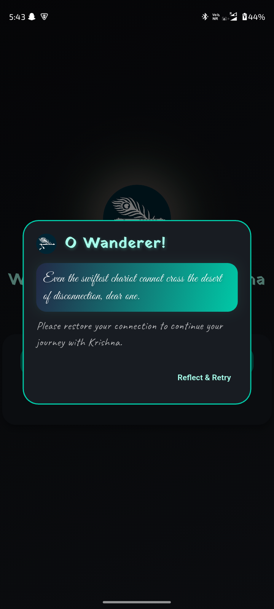

# Krishna Chatbot

[](https://opensource.org/licenses/MIT)  
A conversational chatbot application built with Flutter, designed to provide an interactive and engaging spiritual experience. The chatbot leverages advanced AI capabilities to answer questions, provide guidance, and assist users in their journey with Krishna.

---

## 🚀 Features

- **AI-Powered Conversations**: Get context-aware, compassionate responses inspired by Krishna's wisdom.
- **Spiritual Theming**: Beautiful, immersive UI with animated backgrounds, glowing effects, and Krishna-inspired art.
- **Personalized Chat History**: All your conversations are securely stored and synced with Firebase.
- **Background Music**: Soothing music plays during chat, with mute/unmute controls.
- **Offline Awareness**: The app detects offline status and shows a Krishna-themed reflective alert, preventing login/signup when disconnected.
- **Animated Typing Indicator**: See when Krishna is "typing" a response.
- **Multi-Script Support**: Krishna's replies are shown in a beautiful handwritten font for English, and in a Devanagari-compatible font (Yatra One) for Sanskrit.
- **Cross-Platform**: Runs on Android, iOS, Web, Windows, macOS, and Linux.
- **Secure API Key Management**: Uses `.env` for sensitive keys.
- **State Management**: Clean architecture using Provider.

---

## 🖼️ Screenshots

### Welcome Screen


### Register Screen


### Login Screen


### Chat Interface


### Offline Alert


---

## 🛠️ Technologies Used

- **Frontend**: [Flutter](https://flutter.dev/) (Dart)
- **Backend**: [Firebase](https://firebase.google.com/) (Authentication, Firestore Database)
- **AI Integration**: [OpenRouter](https://openrouter.ai/) (OpenAI GPT-3.5-Turbo API)
- **State Management**: [Provider](https://pub.dev/packages/provider)
- **Environment Management**: [flutter_dotenv](https://pub.dev/packages/flutter_dotenv) for API keys and configurations
- **Connectivity**: [connectivity_plus](https://pub.dev/packages/connectivity_plus)
- **Custom Fonts**: [Google Fonts](https://pub.dev/packages/google_fonts) (Great Vibes, Caveat, Yatra One, Poppins, etc.)
- **Audio**: [audioplayers](https://pub.dev/packages/audioplayers) for background music

---

## 📂 Project Structure

```plaintext
krishna_chatbot/
├── lib/                  # Main Flutter application code
│   ├── main.dart         # Entry point of the application
│   ├── screens/          # UI screens (chat, welcome, login, register, etc.)
│   ├── models/           # Data models (e.g., Message)
│   ├── services/         # API and backend services (e.g., KrishnaApi)
│   └── widgets/          # Reusable UI components (message bubbles, indicators)
├── assets/               # Static assets (images, icons, music, etc.)
│   ├── krishna_bg.png
│   ├── krishna_avatar.png
│   ├── user_avatar.png
│   ├── flute.png
│   └── music/soothing.mp3
├── screenshots/          # App screenshots for documentation
├── .env                  # Environment variables (not committed)
│   └── API_KEY=your_api_key_here
├── pubspec.yaml          # Flutter dependencies and asset declarations
├── .gitignore            # Files and folders to ignore in git
└── README.md             # Project documentation
```

---

## 🔧 Installation

1. **Clone the repository:**
   ```bash
   git clone https://github.com/ArindamTripathi619/krishna_chatbot
   cd krishna_chatbot
   ```

2. **Install dependencies:**
   ```bash
   flutter pub get
   ```

3. **Set up your environment variables:**
   - Create a `.env` file in the root directory:
     ```
     API_KEY=your_openrouter_api_key_here
     ```
   - (Optional) Add other keys as needed.

4. **Add your Firebase configuration:**
   - Place your `google-services.json` (Android) in `android/app/`.
   - Place your `GoogleService-Info.plist` (iOS) in `ios/Runner/`.

5. **Run the app:**
   ```bash
   flutter run
   ```

---

## ⚙️ Customization

- **Change App Name:**  
  Edit `android/app/src/main/AndroidManifest.xml` (`android:label`) and `ios/Runner/Info.plist` (`CFBundleDisplayName`).

- **Change App Icon:**  
  Use [`flutter_launcher_icons`](https://pub.dev/packages/flutter_launcher_icons) and update `assets/app_icon.png`.

- **Change Background Music:**  
  Replace `assets/music/soothing.mp3` with your preferred track and update `pubspec.yaml` if needed.

---

## 📚 Resources

- [Flutter Documentation](https://flutter.dev/docs)
- [Firebase Documentation](https://firebase.google.com/docs)
- [OpenAI GPT API](https://platform.openai.com/docs)
- [OpenRouter API](https://openrouter.ai/docs)
- [Google Fonts](https://fonts.google.com/)

---

## 🎵 Music Credits

- Background music: Portions of "Enchanting Flute" by Rakesh Chaurasia are used in `assets/music/soothing.mp3`.
  - [Listen to the original track](https://youtu.be/yRrU0zCUVJg?si=k6URidie4oo6htRJ)
  - All rights belong to the original artist.

---

## 🧑‍💻 Contributing

Contributions are welcome!  
Feel free to open issues or submit pull requests for improvements, bug fixes, or new features.

---

## 📝 License

This project is licensed under the MIT License - see the [LICENSE](LICENSE) file for details.

---

## 📧 Contact

Created by [Arindam Tripathi](https://github.com/ArindamTripathi619).  
For any inquiries or suggestions, feel free to reach out!

### Social Links  
[](https://www.instagram.com/aritri619/)  [](https://www.facebook.com/arindam.tripathi.180/)  [](https://www.linkedin.com/in/arindam-tripathi-962551349/)  [](https://www.youtube.com/@arindamtripathi4602)  

---


